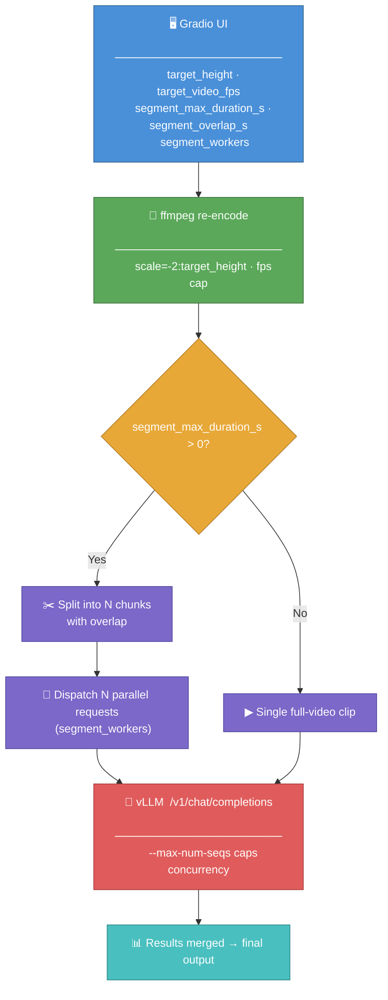

# Gemma 4 + Qwen 3.5 Vision Compare Lab

Local multimodal compare lab for side-by-side testing of two OpenAI-compatible vLLM servers.

This repo builds on the earlier Qwen-only setup and turns it into a local comparison workflow for image, video, and text prompts.

## YouTube Videos

LOCAL AI / VLM SETUP SERIES:

📹 THE ULTIMATE LOCAL AI & VLM SETUP SERIES:
- 1️⃣ Build the Best Vision Setup (No Ollama): https://www.youtube.com/watch?v=-sl0oe3-Awc
- 2️⃣ Speed Tune Your Vision AI (30s → 2s): https://www.youtube.com/watch?v=ZtGOZvkuTcw
- 3️⃣ Process 2-Hour Videos FAST: https://www.youtube.com/watch?v=BxDfOPcak5k
- 4️⃣ The Ultimate Local AI Coding Workflow: https://www.youtube.com/watch?v=11rA29YacB8 
- 5️⃣🆕 Gemma 4 vs Qwen 3.5 Vision AI: One Model Wasn't Even Close!: https://www.youtube.com/watch?v=lqjuztEiyD0


Previous base repo:

- Qwen 3.5 Vision Setup Dockers: https://github.com/lukaLLM/Qwen_3_5_Vision_Setup_Dockers

## What This Repo Does

- runs Qwen 3.5 27B FP8 on `http://127.0.0.1:8000/v1`
- runs Gemma 4 31B FP8 on `http://127.0.0.1:8001/v1`
- gives you one FastAPI + Gradio app to compare both outputs side by side
- supports shared preprocessing for images and videos so both models see the same prepared input
- supports text-only compares, image compares, video compares, and persisted history
- includes prompt presets for search/indexing, summarization, tagging, classification, object detection, and video type checks
- supports single-video segmentation for long clips

The app schema supports up to 2 videos per compare request. The included Docker profiles are intentionally conservative and currently keep each vLLM server at `1` image and `1` video per prompt with `--limit-mm-per-prompt`.


## Video Preprocessing Pipeline


## Benchmark Media

Sample test media lives in [Benchmarks](/home/luke/Documents/Code/Gemma4_Qwen3.5/Benchmarks) and can be used for demos, side-by-side tests, and video examples.

## Requirements

- Linux
- NVIDIA GPU with Docker / CUDA support
- Docker Engine with `docker compose`
- NVIDIA Container Toolkit
- Python `3.12+`
- `uv`
- `ffmpeg` and `ffprobe` on `PATH`
- optional Hugging Face token in repo-root `.env` as `HF_TOKEN=...`

## Quick Setup

1. Create a repo-root `.env` file from the app example:

```bash
cp visual_experimentation_app/.env.example .env
```

2. If you want faster/private model pulls, add your Hugging Face token to `.env`:

```bash
HF_TOKEN=your_huggingface_token_here
```

3. Install Python dependencies:

```bash
uv sync
```

4. Download models:

```bash
chmod +x download_qwen_models.sh
./download_qwen_models.sh
```

The script reads `HF_TOKEN` from `.env` automatically.

This repo currently defaults to the two FP8 models used by the included Docker setup:

- `Qwen/Qwen3.5-27B-FP8`
- `RedHatAI/gemma-4-31B-it-FP8-block`

If you do not want some models, open `download_qwen_models.sh` and comment out entries in:

- `GGUF_MODELS=(...)`
- `HF_MODELS=(...)`

For this repo, `GGUF_MODELS` is empty by default and `HF_MODELS` contains the active FP8 model repos.

Then run the script again.

5. Start the two local vLLM servers:

```bash
docker compose -f docker/compose.qwen3.5-27b-fp8.yaml up -d
docker compose -f docker/compose.gemma4-31b-fp8.yaml up -d
```

6. Start the compare lab:

```bash
uv run python -m visual_experimentation_app
```

7. Open the app:

- UI: `http://127.0.0.1:7870/`
- API: `http://127.0.0.1:7870/api`

Stop the model servers with:

```bash
docker compose -f docker/compose.qwen3.5-27b-fp8.yaml down
docker compose -f docker/compose.gemma4-31b-fp8.yaml down
```

## Default Stack

The default repo setup targets:

- model A: `Qwen/Qwen3.5-27B-FP8`
- model B: `RedHatAI/gemma-4-31B-it-FP8-block`
- app port: `7870`
- results folder: [visual_experimentation_app/results](/home/luke/Documents/Code/Gemma4_Qwen3.5/visual_experimentation_app/results)

Runtime settings are loaded from the repo-root `.env`. See [visual_experimentation_app/.env.example](/home/luke/Documents/Code/Gemma4_Qwen3.5/visual_experimentation_app/.env.example) for:

- `MM_LAB_HOST`, `MM_LAB_PORT`, `MM_LAB_UI_PATH`, `MM_LAB_API_PREFIX`
- `MM_LAB_DEFAULT_TIMEOUT_SECONDS`, `MM_LAB_DEFAULT_TARGET_HEIGHT`, `MM_LAB_DEFAULT_VIDEO_FPS`, `MM_LAB_SAFE_VIDEO_SAMPLING`
- `MM_LAB_MODEL_A_*` and `MM_LAB_MODEL_B_*`
- `MM_LAB_RESULTS_DIR`

## Docker Profiles

Compose files live in [docker](/home/luke/Documents/Code/Gemma4_Qwen3.5/docker).

Included defaults:

- Qwen profile binds host port `8000`
- Gemma profile binds host port `8001`
- both use shared Hugging Face cache from `${HOME}/.cache/huggingface`
- both default to `--max-model-len 10000`
- both default to `--max-num-seqs 1`
- both use `--mm-encoder-tp-mode data`
- both use `--mm-processor-cache-type shm`
- both cap prompts to `1` image and `1` video
- Qwen enables `qwen3` reasoning parsing and supports per-request `thinking_token_budget`
- Gemma uses the Gemma 4 tool chat template and defaults to `max_soft_tokens=280`

These settings are tuned conservatively so both servers can coexist on one large GPU.

## App Features

- shared image and video preprocessing for both model calls
- text-only compare mode
- per-model controls for label, base URL, model ID, API key, timeout, sampling, penalties, thinking, and TTFT measurement
- Qwen-family `thinking_token_budget` override
- Gemma-only `max_soft_tokens` override
- raw `extra_body` and `extra_headers` JSON injection per target
- history tab backed by persisted compare artifacts

Prompt presets:

- `Custom`
- `Search/Indexing`
- `Understanding/Summarization`
- `Visible Chunk Summary`
- `Object Detection (Boxes)`
- `Tagging`
- `Classifier (Single Category)`
- `Video Type (One Word)`

Segmentation is supported when exactly one video is present in the request. The current UI preset profiles are:

- `Balanced (30s / 2s)`
- `Fine-grained (2s / 0.5s)`
- `Off (0s / 0s)`
- `Custom`

## API

Routes:

- `GET /api/health`
- `POST /api/compare`
- `GET /api/compares`
- `GET /api/compares/{compare_id}`

Image compare example:

```bash
curl -X POST http://127.0.0.1:7870/api/compare \
  -H "Content-Type: application/json" \
  -d '{
    "prompt": "Describe the image in detail.",
    "image_paths": ["/absolute/path/to/image.png"]
  }'
```

Text-only compare example:

```bash
curl -X POST http://127.0.0.1:7870/api/compare \
  -H "Content-Type: application/json" \
  -d '{
    "prompt": "Summarize this in plain text.",
    "text_input": "Long input text here...",
    "text_only": true
  }'
```

## Repository Layout

- [visual_experimentation_app](/home/luke/Documents/Code/Gemma4_Qwen3.5/visual_experimentation_app): compare app, UI, schemas, preprocessing, request building, and persistence
- [docker](/home/luke/Documents/Code/Gemma4_Qwen3.5/docker): default vLLM compose files for Qwen and Gemma
- [tests](/home/luke/Documents/Code/Gemma4_Qwen3.5/tests): unit tests for config, schemas, API routes, presets, media helpers, and compare execution
- [Benchmarks](/home/luke/Documents/Code/Gemma4_Qwen3.5/Benchmarks): local sample media for manual validation
- [scripts](/home/luke/Documents/Code/Gemma4_Qwen3.5/scripts): small helper scripts such as bbox preview generation

## Verification

```bash
uv run python -m unittest discover -s tests -v
uv run ruff check .
uv run mypy visual_experimentation_app
```

## References

- https://docs.vllm.ai/en/stable/features/multimodal_inputs/
- https://docs.vllm.ai/en/latest/serving/openai_compatible_server/
- https://github.com/vllm-project/vllm/blob/main/docs/configuration/optimization.md
- https://blog.overshoot.ai/blog/qwen3.5-on-overshoot
- https://build.nvidia.com/nvidia/video-search-and-summarization
